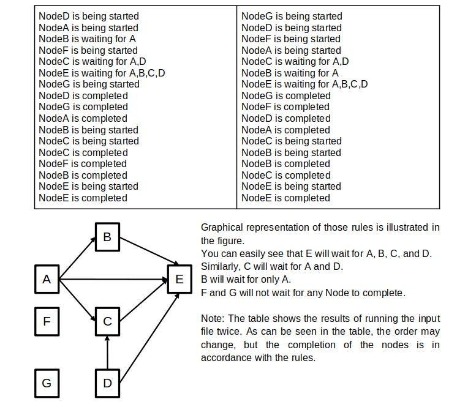

# Project Definition
In this project, you will create several threads and they wait for each other according to the given rules.

First, you should create an input file that includes the rules. For instance, if your input file includes the following lines:

```input1.txt
A,B,C,D->E
A->B
A,D->C
F
G
```
This means that node E will wait for the execution of nodes A, B, C, and D to complete. Similarly, Node B will wait for node A to complete. Nodes F and G will not wait for any node to complete, so they should be executed immediately. 

Details:
* The Node class should extend the Thread class.
* This class will have a perform() method, which simulates a job with a long execution time.
* The simulation can be done using Thread.sleep(time) method. Time should be passed by a randomly generated integer with a maximum value of 2000 milliseconds.

Sample Outputs for input1.txt;

```input1.txt
A,B,C,D->E
A->B
A,D->C
F
G
```

After `mvn clean package` command is applied and `java -jar ThreadJoining.jar -i input1.txt` command is applied;




# Grading Criteria
* If `mvn compile` does not work, you will get 0 point.
* If you change the pom.xml, package names, class names (given file structure) or /test folder, you will be `penalized`  with 30 points.
* Programming logic and correct output defined in `Tests to run` section below are worth 100 points.

# Requirements
* Your project should be a maven project.
* Use Java 17 and Apache Maven 3.9.6.
* Do not modify the pom.xml file, .gitignore file and /test folder.
* Check out the Tests to Run section below. Make sure the tests run successfully.
* Push your changes to your repository (created after clicking the invitation link) after completing the assignment.

# Tests to run

### Test 

Make sure to run the tests below seperately before pushing the repository. All the tests should pass.
```bash
mvn -Dtest=MainTest test
```

```bash
mvn -Dtest=Main2Test test
```


